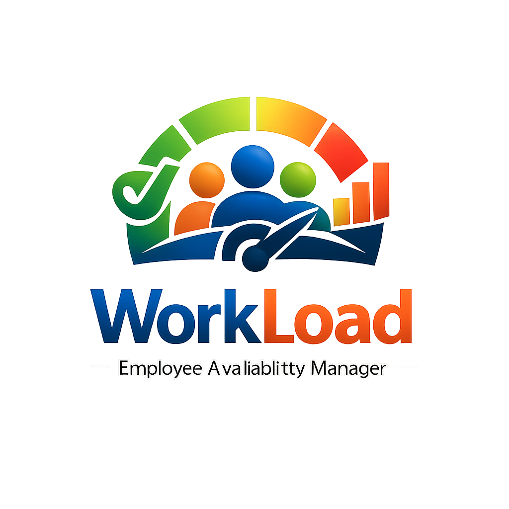

# 

# WorkLoad - PWA Frontend

WorkLoad is a comprehensive Progressive Web Application (PWA) designed to simplify employee availability management and project tracking. This frontend client provides an intuitive and responsive interface for both employees and managers, enabling efficient logging of hours, real-time updates, and capacity planning.

## 🚀 Tech Stack

- **Framework:** [React](https://reactjs.org/) (Create React App)
- **Routing:** [React Router](https://reactrouter.com/)
- **Styling:** [Styled Components](https://styled-components.com/), [Bootstrap](https://getbootstrap.com/), [React Bootstrap](https://react-bootstrap.github.io/)
- **Date Handling:** `react-datepicker`
- **Notifications:** `react-toastify` (Toasters)
- **PWA Features:** Service Workers, Web Push Notifications, Manifest
- **Testing:** `jest`, `@testing-library/react`

## 👥 User Roles & Workflows

### For Managers
- **Availability Tracking:** The **Manager Dashboard** provides a comprehensive view of all employee schedules, allowing managers to instantly visualize team capacity and individual availability.
- **Inline Activities:** Managers can create and assign **Inline Activities**. These tasks appear on employee dashboards, ensuring clear communication of priorities.
- **Performance Recognition:** Managers can award **Stars** to employees based on their performance and timely updates, fostering a gamified and motivating environment.

### For Employees
- **Mandatory Updates:** To ensure data accuracy, employees are **forced to update their Detail Screen every 15 days**. If the data is stale, access to other features is restricted until the details are refreshed.
- **Task Visibility:** Employees can view **Inline Activities** created by managers on their dashboard. These entries are read-only for employees, serving as a clear directive of assigned work.

## 📂 Project Structure

```
workload_frontend/
├── public/           # Static assets (Workload.png, manifest.json, icons)
├── src/
│   ├── components/   # Reusable UI components (Navbar, Popups, etc.)
│   ├── screens/      # Page components (Dashboard, Login, Profile, etc.)
│   ├── hooks/        # Custom React hooks
│   ├── utils/        # Utility functions
│   ├── App.js        # Main application component and routing
│   ├── config.js     # Configuration constants (e.g., API URLs)
│   └── index.js      # Entry point
└── package.json      # Dependencies and scripts
```

## 🛠️ Setup & Installation

1.  **Navigate to the frontend directory:**
    ```bash
    cd workload_frontend
    ```
2.  **Install dependencies:**
    ```bash
    npm install
    ```
3.  **Start the development server:**
    ```bash
    npm start
    ```
    The app will run in development mode at `http://localhost:3000`.

## 📜 Scripts

- `npm start`: Runs the app in development mode.
- `npm run build`: Builds the app for production to the `build` folder.
- `npm test`: Launches the test runner.

## 📱 PWA Features & Notifications

- **Installable:** Includes `manifest.json` for home screen installation (appearing as "WorkLoad").
- **Push Notifications:** Supports real-time updates for:
    - New activity postings (Broadcast to ICs).
    - Login alerts (Security).
    - Profile and Password changes.
    - Enable this in the **Profile Screen**.

## 🛡️ Protected Routes

- **Authentication:** Routes are protected to ensure only logged-in users access the dashboard.
- **Role-Based Access:** Specific views (like Manager Dashboard) are restricted based on user roles (`Manager` vs `Employee`).
